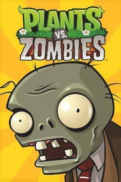
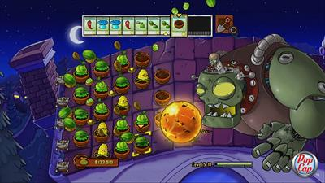
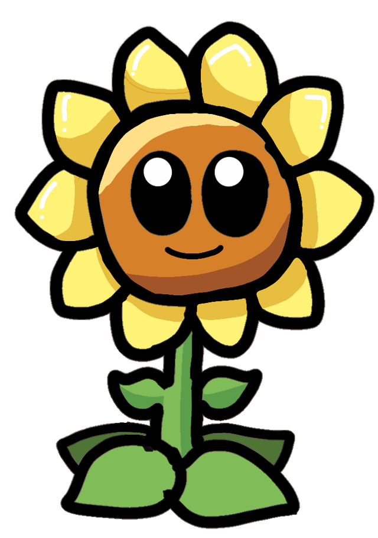
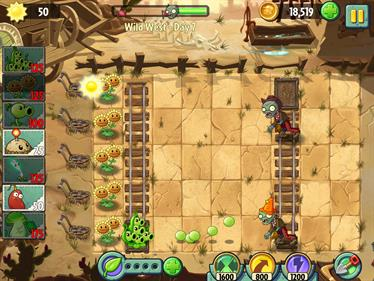
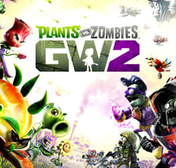

# تحقیق درباره‌ی بازی «گیاهان در برابر زامبی‌ها» (Plants vs. Zombies)

## ۱. معرفی کلی

«Plants vs. Zombies» یک بازی ویدیویی در سبک **برج‌دفاعی (Tower Defense)** است که توسط استودیوی **PopCap Games** ساخته و منتشر شد. بازی برای اولین بار در **۵ مه ۲۰۰۹** برای ویندوز و مک عرضه شد و بعداً به کنسول‌ها، دستگاه‌های دستی و موبایل هم آمد.

بازیکن نقش صاحب‌خانه‌ای را دارد که در میانه‌ی یک آخرالزمان زامبی گرفتار شده است؛ گله‌های زامبی از سمت راست در چند خط موازی به سمت خانه می‌آیند و بازیکن باید با کاشتن گیاهان و قارچ‌های مختلف جلوی آن‌ها را بگیرد.

| مشخصه | توضیح |
|---|---|
| سازنده | PopCap Games |
| طراح اصلی | جورج فن (George Fan) |
| آهنگساز | لورا شیگیهارا (Laura Shigihara) |
| برنامه‌نویس | تاد سمپل (Tod Semple) |
| هنرمند | ریچ ورنر (Rich Werner) |
| تاریخ انتشار | ۵ مه ۲۰۰۹ |
| سبک | برج‌دفاعی / استراتژی آنی |
| مدت ساخت | حدود ۳ سال و نیم |

## ۲. گیم‌پلی

- زمین بازی به چند **خط افقی** (۵ یا ۶ لاین) تقسیم شده است. هر زامبی معمولاً فقط در همان لاین خودش جلو می‌آید.
- بازیکن با جمع‌آوری منبعی به نام **خورشید (Sun)** گیاه می‌خرد. خورشید یا از آسمان می‌افتد یا توسط **آفتابگردان (Sunflower)** تولید می‌شود.
- بیشتر گیاهان فقط در لاین خودشان حمله یا دفاع می‌کنند؛ بنابراین **چیدمان صحیح** مهم‌ترین بخش استراتژی است.
- در ابتدای هر لاین یک **ماشین چمن‌زنی (Lawnmower)** یک‌بارمصرف قرار دارد که اگر زامبی به خانه برسد فعال می‌شود و همه‌ی زامبی‌های آن لاین را از بین می‌برد. اگر دوباره زامبی به خانه برسد، بازی تمام است.
- مراحل در محیط‌های مختلف می‌گذرد: حیاط روز، حیاط شب (با قارچ‌ها)، استخر، مه‌آلود شبانه و پشت‌بام.

### مُدهای بازی
- **Adventure (ماجراجویی):** حالت داستانی اصلی؛ مرحله‌ی پایانی مبارزه با **دکتر زامباس (Dr. Zomboss)** و ربات غول‌پیکرش «زامبات» است.
- **Mini-Games:** مینی‌گیم‌های متنوع، از جمله نسخه‌های زامبی‌شده‌ی بازی‌های دیگر PopCap مثل Bejeweled.
- **Puzzle (پازل):** شامل «Vasebreaker» و «I, Zombie» که در آن بازیکن نقش زامبی‌ها را بازی می‌کند.
- **Survival (بقا):** مقاومت در برابر موج‌های پشت‌سرهم زامبی.
- **Zen Garden:** باغی برای نگهداری و پرورش گیاهانی که در بازی به دست می‌آورید.

## ۳. شخصیت‌ها

### گیاهان شاخص
| گیاه | نقش |
|---|---|
| Peashooter (نخودپران) | پایه‌ای‌ترین گیاه مهاجم؛ نخود شلیک می‌کند |
| Sunflower (آفتابگردان) | تولید خورشید؛ ستون اقتصاد بازی |
| Wall-nut (گردوی دیواری) | سپر دفاعی با جان بالا |
| Cherry Bomb (بمب گیلاس) | انفجار ناحیه‌ای |
| Potato Mine (مین سیب‌زمینی) | مین زمینی؛ الهام‌گرفته از فیلم Swiss Family Robinson |
| Snow Pea (نخود یخی) | کند کردن زامبی‌ها |
| Chomper (بلعنده) | زامبی را کامل می‌بلعد ولی زمان هضم دارد |
| Jalapeño / Ice-shroom | پاک‌سازی کل یک لاین با آتش یا یخ |

### زامبی‌ها
زامبی ساده، زامبی مخروطی (Conehead)، زامبی سطلی (Buckethead)، زامبی پرچم‌دار، زامبی روزنامه‌خوان، زامبی نردبانی، زامبی رقصنده (Dancing Zombie)، زامبی دلفین‌سوار، زامبی غول‌پیکر (Gargantuar) و در نهایت **دکتر ادگار جورج زامباس** رهبر زامبی‌ها. شخصیت «Crazy Dave» (دیوید بلیزینگ) هم همسایه‌ی دیوانه‌ای است که در طول بازی راهنمای بازیکن است و به گیاهانش می‌بالد.

> نکته‌ی جالب: زامبی رقصنده در ابتدا شبیه به یک خواننده‌ی مشهور طراحی شده بود، اما پس از اعتراض وُراث او، PopCap آن را با یک زامبی دیسکوی عمومی جایگزین کرد.

## ۴. تاریخچه‌ی ساخت

- ایده‌ی اولیه‌ی جورج فن، دنباله‌ای برای بازی قبلی‌اش **Insaniquarium** بود؛ ابتدا قرار بود دشمنان **فضایی‌ها** باشند و به باغ بازیکن حمله کنند، اما پس از اینکه فن «زامبی ایده‌آل» را طراحی کرد، دشمنان به زامبی تغییر کردند.
- نام اولیه‌ی پروژه **Weedlings** بود که چون بازار پر از بازی‌های «پرورش گیاه» بود، کنار گذاشته شد.
- بخش آبیاری و نگهداری گیاهان به‌خاطر خسته‌کننده بودن حذف شد و تمرکز روی دفاع ماند.
- یکی از مهم‌ترین تصمیم‌های بالانس بازی، **نصف کردن قیمت آفتابگردان از ۱۰۰ به ۵۰ خورشید** بود؛ چون تازه‌کارها همه‌ی خورشیدشان را خرج نخودپران می‌کردند و می‌باختند.
- آموزش بازی عمداً درون خودِ گیم‌پلی جاسازی شد («یادگیری با انجام دادن») تا برای مخاطب کژوال هم جذاب باشد.

## ۵. استقبال و جوایز

- بازی از سوی منتقدان **تحسین گسترده** دریافت کرد؛ سبک هنری بامزه، گیم‌پلی ساده اما عمیق، و موسیقی متن (به‌ویژه ترانه‌ی پایانی «Zombies on Your Lawn») بیشترین تعریف را گرفتند.
- سریع‌ترین بازی پرفروش تاریخ PopCap شد و از Bejeweled و Peggle هم جلو زد.
- نامزد جوایزی مثل «بازی دانلودی سال» و «بازی استراتژیک سال» در **Golden Joystick Awards 2010**.
- امروز به‌عنوان یکی از بهترین بازی‌های ویدیویی تاریخ شناخته می‌شود.

## ۶. سرنوشت استودیو و مجموعه

- در **۱۲ ژوئیه ۲۰۱۱**، شرکت **Electronic Arts (EA)** استودیوی PopCap را با مبلغ **۷۵۰ میلیون دلار** خرید.
- در **۲۱ اوت ۲۰۱۲**، پنجاه کارمند از دفتر سیاتل اخراج شدند — از جمله خودِ **جورج فن**، خالق بازی. او بعداً بازی مستقل **Octogeddon** را ساخت.
- تمرکز شرکت به سمت بازی‌های موبایل و اجتماعی تغییر کرد.

### بازی‌های مجموعه
| بازی | سال | سبک |
|---|---|---|
| Plants vs. Zombies | ۲۰۰۹ | برج‌دفاعی |
| PvZ Adventures | ۲۰۱۳ | اجتماعی/فیس‌بوک (تعطیل شد) |
| PvZ 2: It's About Time | ۲۰۱۳ | برج‌دفاعی، فری‌میوم |
| PvZ: Garden Warfare | ۲۰۱۴ | شوتر سوم‌شخص آنلاین |
| PvZ: Garden Warfare 2 | ۲۰۱۶ | شوتر سوم‌شخص (با حالت آفلاین) |
| PvZ Heroes | ۲۰۱۶ | بازی کارتی دیجیتال |
| PvZ: Battle for Neighborville | ۲۰۱۹ | شوتر سوم‌شخص |
| PvZ 3 | جدیدترین نسخه‌ی اصلی | برج‌دفاعی موبایل |
| PvZ: Replanted | اکتبر ۲۰۲۵ | بازسازی (Remaster) نسخه‌ی اول |

یک بازی تک‌نفره‌ی لغوشده هم با نام رمز **«Project Hot Tub»** بین سال‌های ۲۰۱۵ تا ۲۰۱۷ در EA در دست ساخت بود؛ یک بازی اکشن شبیه Uncharted درباره‌ی دو نوجوان که در زمان سفر می‌کنند.

## ۷. چرا این بازی موفق شد؟

1. **سادگی در یادگیری، عمق در استراتژی** — هم کژوال‌ها هم بازیکنان حرفه‌ای راضی بودند.
2. **طراحی کاراکتر به‌یادماندنی** — هر گیاه و زامبی شخصیت بصری منحصربه‌فرد دارد.
3. **طنز و لحن بامزه** — توضیحات «آلماناک حومه‌ی شهر» که استیون نوتلی نوشته، پر از شوخی است.
4. **بالانس دقیق** — سه سال و نیم تست و تکرار روی جزئیاتی مثل قیمت آفتابگردان.
5. **موسیقی متن خاطره‌انگیز** ساخته‌ی لورا شیگیهارا.

---

### منابع
- [Plants vs. Zombies — Wikipedia (franchise)](https://en.wikipedia.org/wiki/Plants_vs._Zombies)
- [Plants vs. Zombies (video game) — Wikipedia](https://en.wikipedia.org/wiki/Plants_vs._Zombies_(video_game))
- [PvZ Wiki — Plants vs. Zombies (series)](https://plantsvszombies.fandom.com/wiki/Plants_vs._Zombies_(series))
- [PopCap Games Wiki](https://popcapgames.fandom.com/wiki/PopCap_Games_Wiki:Plants_vs._Zombies)

> تصاویر از نتایج جست‌وجوی تصویری وب جمع‌آوری شده‌اند و حقوق آن‌ها متعلق به PopCap Games / Electronic Arts و صاحبان اثر است.
