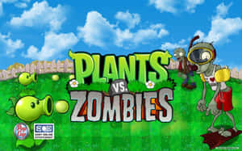
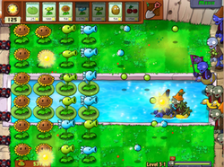
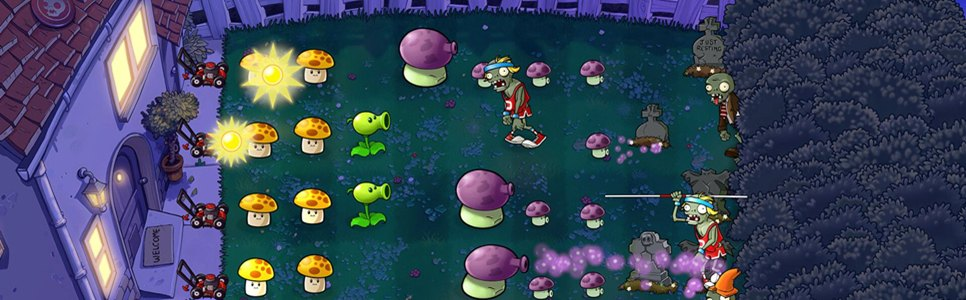
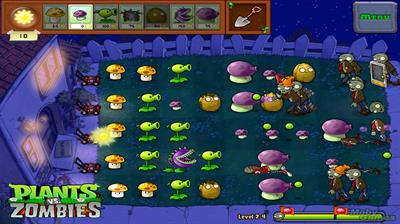
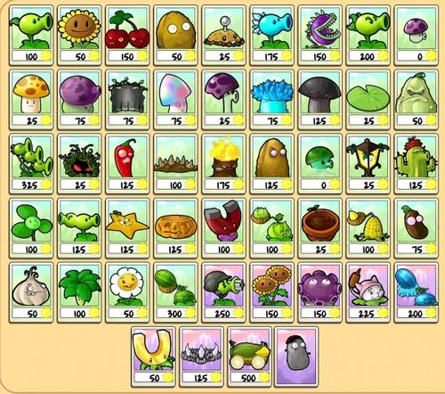
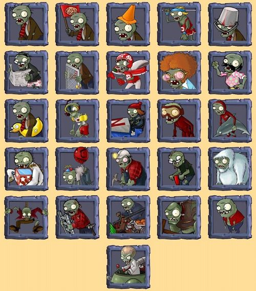
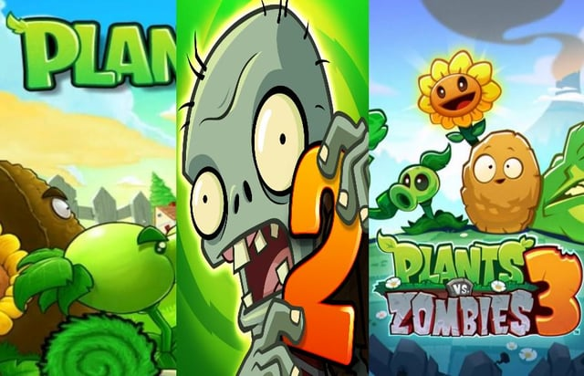
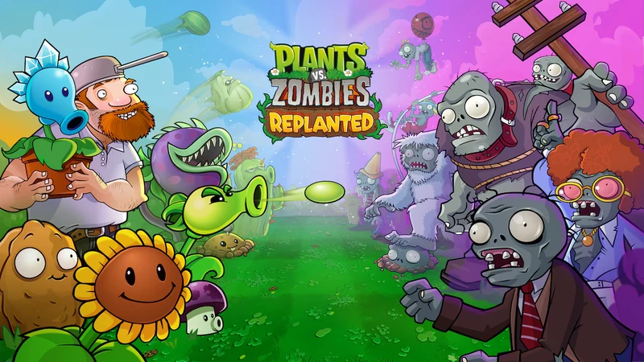

# تحقیق: گیاهان در برابر زامبی‌ها (Plants vs. Zombies)

خلاصه تحقیق درباره مجموعه بازی **Plants vs. Zombies** به همراه گالری تصاویر.
نسخه وب این تحقیق: [`index.html`](index.html)

---

## ۱. در یک نگاه

| مورد | توضیح |
| --- | --- |
| سازنده | PopCap Games (از ۲۰۱۱ زیرمجموعه Electronic Arts) |
| طراح | جرج فَن (George Fan) |
| هنرمند | ریچ ورنر (Rich Werner) |
| برنامه‌نویس | تاد سمپل (Tod Semple) |
| آهنگساز | لورا شیگیهارا (Laura Shigihara) |
| اولین انتشار | ۵ مه ۲۰۰۹ — ویندوز و مک |
| سبک | برج‌دفاعی (Tower Defense) |
| مدت ساخت | حدود ۳.۵ سال با تیمی چهار نفره |
| امتیاز متاکریتیک | PC: ۸۷/۱۰۰ — iOS: تا ۹۳/۱۰۰ |
| تازه‌ترین نسخه | Plants vs. Zombies: Replanted — ۲۳ اکتبر ۲۰۲۵ |

---

## ۲. داستان و جهان بازی

مجموعه حول شخصیت **دیوِ دیوانه (Crazy Dave Blazing)** و همراهانش می‌چرخد که با
کاشتن گیاهان جنگجو، جلوی حمله‌ی زامبی‌ها به رهبری **دکتر ادگار جرج زامباس
(Dr. Edgar George Zomboss)** را می‌گیرند. هدف زامبی‌ها رسیدن به خانه و خوردن مغز
بازیکن است.

---

## ۳. گیم‌پلی

زمین بازی یک حیاط با **۵ یا ۶ ردیف** است. زامبی‌ها از راست وارد می‌شوند و باید قبل از
رسیدن به خانه متوقف شوند. منبع اصلی بازی **«آفتاب» (Sun)** است که از آسمان می‌بارد یا
آفتابگردان‌ها تولیدش می‌کنند.

دسته‌بندی گیاهان:

- **اقتصادی:** آفتابگردان، قارچ‌آفتابی
- **تهاجمی:** نخودپاش، تک‌تیرانداز برفی، گیاه گوشت‌خوار، ذرت‌توپ
- **دفاعی:** گردوی دیواری، گردوی بلندین
- **انفجاری:** بمب‌گیلاسی، سیب‌زمینی‌مین، فلفل‌تند

انواع مراحل: روز، شب (با قارچ‌ها)، استخر، مه، پشت‌بام، به‌علاوه مینی‌گیم‌ها و حالت
پازل مثل **Vasebreaker** و **I, Zombie**.

---

## ۴. شخصیت‌ها

### گیاهان

نسخه اول حدود **۴۹ گیاه** دارد. نکته‌ی جالب طراحی: قیمت آفتابگردان در جریان ساخت از
۱۰۰ به **۵۰** کاهش پیدا کرد تا بازیکن تازه‌کار اول اقتصادش را بسازد؛ این تغییر باعث شد
کل تعادل بازی دوباره بازطراحی شود.

### زامبی‌ها

از زامبی معمولی تا انواع تخصصی: مخروط‌به‌سر، سطل‌به‌سر، نردبان‌دار، غواص، ژیمناست با
میله، روزنامه‌خوان و رقصنده. رئیس نهایی **دکتر زامباس** با ربات غول‌پیکر **زامبات** است.

---

## ۵. پشت‌صحنه‌ی ساخت

- ایده‌ی اولیه ادامه‌ای بر بازی *Insaniquarium* بود؛ ابتدا قرار بود **فضایی‌ها** به باغ
  حمله کنند، اما بعد از اینکه فَن طرح «زامبی ایده‌آل» را کشید، دشمن‌ها به زامبی تغییر کردند.
- نام‌های کاری: **Weedlings** و **Bloom & Doom**.
- نام پیشنهادی **Lawn of the Dead** (بازی با عنوان فیلم *Dawn of the Dead*) بود؛ تیم حتی
  ویدیویی برای جرج رومرو فرستاد تا اجازه بگیرد، ولی او موافقت نکرد.
- ایده‌ی «گیاه به‌جای برج» از دیدن برج‌های *Warcraft III* آمد؛ الهام دیگر بازی
  *Magic: The Gathering* و فیلم *Swiss Family Robinson* بود.
- ترانه‌ی تیتراژ پایانی **«Zombies on Your Lawn»** با صدای لورا شیگیهارا، خودش ویروسی شد و
  بخش مهمی از بازاریابی ارگانیک بازی را رقم زد.

---

## ۶. خط زمانی مجموعه

| سال | عنوان | توضیح |
| --- | --- | --- |
| ۲۰۰۹ | Plants vs. Zombies | نسخه اصلی، PC و مک |
| ۲۰۱۰ | Game of the Year Edition | بازنشر با محتوای اضافه |
| ۲۰۱۱–۲۰۱۴ | Social / Great Wall / Endless Edition | نسخه‌های ویژه بازار چین |
| ۲۰۱۳ | PvZ Adventures | اسپین‌آف فیس‌بوکی (تعطیل در اکتبر ۲۰۱۴) |
| ۲۰۱۳ | PvZ 2: It's About Time | دنباله موبایلی رایگان با مکانیک «غذای گیاه» |
| ۲۰۱۴ | Garden Warfare | تغییر ژانر به شوتر سوم‌شخص آنلاین |
| ۲۰۱۶ | Garden Warfare 2 | دنباله شوتر، این بار با حالت آفلاین |
| ۲۰۱۶ | PvZ Heroes | بازی کارتی دیجیتال |
| ۲۰۱۹ | Battle for Neighborville | سومین شوتر مجموعه |
| ۲۰۲۴ | PvZ 3: Welcome to Zomburbia | عرضه آزمایشی مجدد با بازطراحی کامل |
| ۲۰۲۵ | PvZ: Replanted | بازسازی نسخه اصلی، ۲۳ اکتبر ۲۰۲۵ |

> یک بازی تک‌نفره‌ی لغوشده هم به اسم رمز **«Project Hot Tub»** بین ۲۰۱۵ تا ۲۰۱۷ در
> PopCap ونکوور در دست ساخت بود؛ یک بازی اکشن در مایه‌های *Uncharted* درباره دو نوجوان
> که در زمان سفر می‌کردند.

---

## ۷. بازخورد و میراث

- متاکریتیک PC: **۸۷/۱۰۰** — نسخه‌های iOS تا **۹۳/۱۰۰**.
- در ۹ روز اول روی App Store بیش از **۳۰۰٬۰۰۰ نسخه** فروخت و از **۱ میلیون دلار** درآمد گذشت.
- سریع‌ترین بازی پرفروش تاریخ PopCap شد و از Bejeweled و Peggle جلو زد.
- **برنده:** Golden Joystick 2010 در دو بخش «بازی دانلودی سال» و «بازی استراتژیک سال»؛
  همچنین «بهترین بازی کژوال» در IMGA 2011.
- **نامزد:** BAFTA Games Awards، Game Developers Choice Awards، Interactive Achievement Awards، Spike VGA.
- در ژوئیه ۲۰۱۱ شرکت EA، استودیوی PopCap را با **۷۵۰ میلیون دلار** خرید. سال بعد جرج فَن
  و ۴۹ نفر دیگر تعدیل شدند؛ فَن بعداً استودیوی خودش را زد و بازی *Octogeddon* (۲۰۱۸) را ساخت.
- نسخه اصلی روی Steam همچنان رتبه‌ی «Overwhelmingly Positive» با بیش از **۱۳۰٬۰۰۰ نقد کاربری** دارد.

### نقدهای وارد به دوران EA

- **PvZ 2** فقط روی موبایل منتشر شد و مدل دسترسی همه‌جانبه‌ی نسخه اول را کنار گذاشت.
- سختی مراحل در PvZ 2 و PvZ Heroes به شکل محسوسی بالا رفت که منتقدان آن را به سیستم
  خرید درون‌برنامه‌ای نسبت دادند.
- نسخه اول **PvZ 3** (۲۰۱۹) با انتقاد شدید مواجه و از دسترس خارج شد و از پایه بازسازی گردید.

---

## ۸. تصاویر

همه تصاویر در پوشه [`images/`](images/) ذخیره شده‌اند:

| فایل | توضیح |
| --- | --- |
| `01-logo.jpg` | لوگو و آرت رسمی بازی |
| `02-gameplay-pool.png` | گیم‌پلی مرحله استخر |
| `03-gameplay-night-roof.jpg` | گیم‌پلی مرحله شب با قارچ‌ها |
| `04-gameplay-fog.jpg` | گیم‌پلی مرحله مه‌آلود |
| `05-plants-almanac.jpg` | سالنامه کامل گیاهان + قیمت آفتاب |
| `06-zombies-almanac.jpg` | سالنامه کامل زامبی‌ها |
| `07-series.jpg` | کاور سه نسخه اصلی مجموعه |
| `08-replanted.webp` | پوستر رسمی Replanted (۲۰۲۵) |

> تصاویر از طریق جست‌وجوی تصویر وب جمع‌آوری شده‌اند و حق مالکیت آن‌ها متعلق به
> PopCap Games / Electronic Arts است. صرفاً برای مقاصد توضیحی و غیرتجاری استفاده شده‌اند.

---

## ۹. منابع

- [ویکی‌پدیا — Plants vs. Zombies (video game)](https://en.wikipedia.org/wiki/Plants_vs._Zombies_(video_game))
- [ویکی‌پدیا — مجموعه Plants vs. Zombies](https://en.wikipedia.org/wiki/Plants_vs._Zombies)
- [Plants vs. Zombies Wiki (wiki.gg)](https://plantsvszombies.wiki.gg/wiki/Plants_vs._Zombies)
- [PC Gamer — معرفی Replanted](https://www.pcgamer.com/games/strategy/zombies-are-on-the-lawn-again-plants-vs-zombies-is-coming-back-with-a-replanted-remaster-featuring-the-original-campaign-plus-new-game-modes-co-op-and-pvp-support-and-more/)
- [PCGamingWiki — Plants vs. Zombies](https://www.pcgamingwiki.com/wiki/Plants_vs._Zombies)
